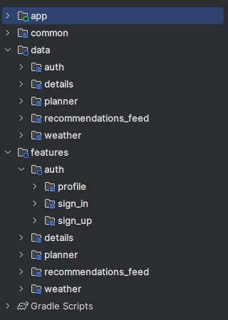

# Документация

## Архитектура

### Обобщенно

Проект многомодульный. Всего в нем 17 модулей, среди которых 4 основных модуля: app, features, data и common.

В features лежат модули фич. Каждый модуль в features разделяется на presentation слой (экран и viewModel) и
на domain слой с бизнес логикой. Также каждой фиче есть папка data с интерфейсами репозиториев, которые реализованы
в data модулях фич.

В data модуле лежат data модули для фич с реализациями репозиториев.

В common лежат общие файлы.

App является склеивающим модулем, который связывает все фичи воедино.
Также в app модуле реализована навигация.

Проект построен по принципам чистой архитектуры с использованием MVVM.

### Погода

Виджет сделан в виде фичи :features:weather :data:weather. К погоде написаны тесты, реализованы shimmer effect,
pullToRefresh.

### Лента рекомендаций

Лента рекомендаций сделана отдельной фичей :features:recommendations_feed :data:recommendation_feed.
Пагинация сделана самостоятельно без использования каких либо библиотек. Лента поддерживает
разные виды объектов. Реализован pullToRefresh.

### Детали рекомендованных мест.

Детали сделаны в виде фичи :features:details :data:details. Реализован механизм кеширования.

### Авторизация

Авторизация сделана в виде фичи, что обеспечивает ее независимость. :features:auth :data:auth.
Выполняется хеширование паролей перед сохранением в бд.

### Планнер доступа

Планер сделан в виде фичи :features:planner :data:planner. Планер привязывается к аккаунту пользователя.

### Примечание

Api ключи лежат в common -> CommonConstants

